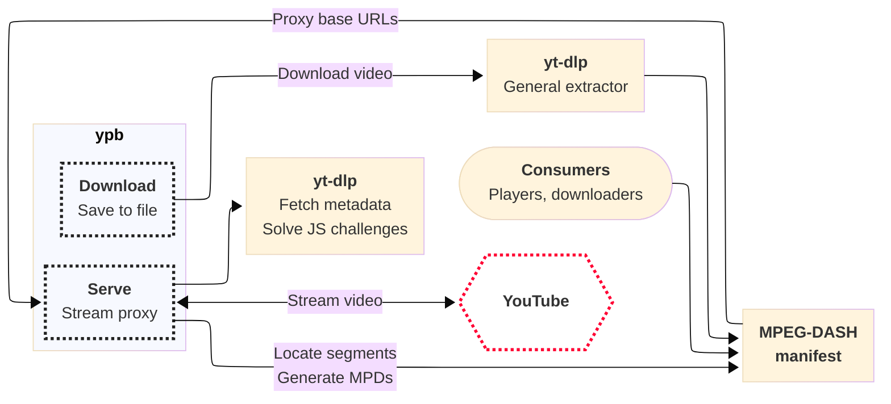

# Ypb — A playback for YouTube live streams

[Project page](https://github.com/xymaxim/ypb) · [Documentation](https://xymaxim.github.io/ypb) · [Changelog](https://xymaxim.github.io/ypb/changelog.html)

*Rewind to past moments in live streams and play or download excerpts*

Ypb is a playback tool for YouTube live streams written in Go. It provides
MPEG-DASH access to past moments in live streams, allowing you to rewind beyond
the web player's limits, play selected excerpts instantly in any compatible
player, or download them as local files.

## Features

- Standalone CLI and proxy streaming server for playback
- Rewind precisely to past moments far beyond the web player’s limits
- Play excerpts immediately without downloading
- Works with any MPEG-DASH compatible player or downloader
- Uses [yt-dlp](https://github.com/yt-dlp/yt-dlp/) to reliably fetch info and download media

## Overview



Ypb runs in two modes: serve and download.

Serve mode runs a local HTTP proxy server that [handles
requests](https://xymaxim.github.io/ypb/reference/api.html) to locate moments in
the stream, generate MPEG-DASH manifests, and serve media segments with HTTP
error retry handling.

Download mode saves excerpts to local files with a single command, using the
same proxy internally to compose manifests before handing off to yt-dlp's
general extractor. Both modes rely on yt-dlp for fetching video information and
solving JavaScript challenges.

## Installation

Ypb works on Linux, macOS, and Windows.

Read the
[Installation](https://xymaxim.github.io/ypb/guides/install/install.html) guide
for different ways to install and run `ypb`.

## Showcase

### Download stream excerpts

Download the latest 10 minutes from a live stream to a local file:

```shell
$ ypb download --interval 10m/now Mm_zVDDUeNA && ls
Live-and-Just-Hatched-Royal_Mm_zVDDUeNA_20260208T054630+00_10m.mp4
``` 

Or download a similar excerpt from one day ago:

```shell
$ ypb download --interval 'now - 1d10m/now - 1d' Mm_zVDDUeNA && ls
Live-and-Just-Hatched-Royal_Mm_zVDDUeNA_20260207T054630+00_10m.mp4
``` 

### Serve stream excerpts

Start the playback server to enable rewind requests:

```shell
ypb serve --port 8080 Mm_zVDDUeNA
```

With the server running, you can preview rewind excerpts, for example, with
`ffplay`:

```shell
ffplay -autoexit -protocol_whitelist file,http,https,tcp,tls \
  http://localhost:8080/mpd/10m--now
```

Or download them with `yt-dlp`:

```shell
yt-dlp http://localhost:8080/mpd/10m--now
```

## License

GNU General Public License v3.0.
