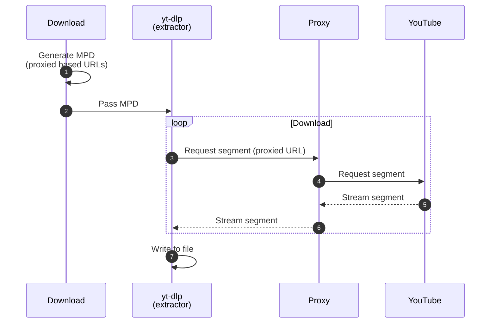

# Ypb — A playback for YouTube live streams

[](https://github.com/xymaxim/ypb/actions/workflows/test.yml)
[](https://github.com/xymaxim/ypb/releases/latest)

[Project page](https://github.com/xymaxim/ypb) &nbsp; [Documentation](https://xymaxim.github.io/ypb) &nbsp; [Changelog](https://xymaxim.github.io/ypb/changelog/)

*Rewind to past moments in live streams and play or download excerpts*

Ypb is a playback tool for YouTube live streams written in Go. It provides
MPEG-DASH access to past moments in live streams, allowing you to rewind beyond
the web player's limits, play selected excerpts instantly in any compatible
player, or download them as local files.

## Features

- Standalone CLI and proxy streaming server for playback
- Rewind precisely to past moments far beyond the web player’s limits
- Play excerpts immediately without downloading
- Works with any MPEG-DASH compatible player or downloader
- Uses [yt-dlp](https://github.com/yt-dlp/yt-dlp/) to reliably fetch info and download media

## Overview


```mermaid
sequenceDiagram
    autonumber
    participant D as Download
    participant E as yt-dlp<br/>(extractor)
    participant P as Proxy
    participant Y as YouTube
    D->>D: Generate MPD<br/>(proxied based URLs)
    D->>E: Pass MPD
    loop Download
        E->>P: Request segment (proxied URL)
        P->>Y: Request segment
        Y-->>P: Stream segment
        P-->>E: Stream segment
    end
    E->>E: Write to file
```

*Download mode passes a composed MPEG-DASH manifest to yt-dlp's general extractor*

Ypb runs in three modes: serve, download, and play.

**Serve** mode runs a local HTTP proxy server that generates MPEG-DASH manifests
(MPDs) and serves media segments, usable with any MPEG-DASH compatible player
or downloader. **Download** mode composes a manifest and passes it to yt-dlp's
general extractor to save an excerpt as a local file. **Play** mode opens a
minimal web page with the dash.js player, letting you preview excerpts by
rewinding directly in the browser.

See [Overview](https://xymaxim.github.io/ypb/overview/) for more on each mode.

## Installation

Ypb works on Linux, macOS, and Windows.

Read the [Installation](https://xymaxim.github.io/ypb/guides/install/install/)
guide for different ways to install and run `ypb`.

## Showcase

### Download stream excerpts

Download the latest 10 minutes from a live stream to a local file:

```shell
$ ypb download --interval 10m/now Mm_zVDDUeNA && ls
Live-and-Just-Hatched-Royal_Mm_zVDDUeNA_20260208T054630+00_10m.mp4
``` 

Or download a similar excerpt from one day ago:

```shell
$ ypb download --interval 'now - 1d10m/now - 1d' Mm_zVDDUeNA && ls
Live-and-Just-Hatched-Royal_Mm_zVDDUeNA_20260207T054630+00_10m.mp4
``` 

### Serve stream excerpts

Start the playback server to enable rewind requests:

```shell
ypb serve --port 9000 Mm_zVDDUeNA
```

With the server running, you can preview rewind excerpts, for example, with
`ffplay`:

```shell
ffplay -autoexit -protocol_whitelist file,http,https,tcp,tls \
  http://localhost:9000/mpd/10m--now
```

Or download them with `yt-dlp`:

```shell
yt-dlp http://localhost:9000/mpd/10m--now
```

## License

GNU General Public License v3.0.
