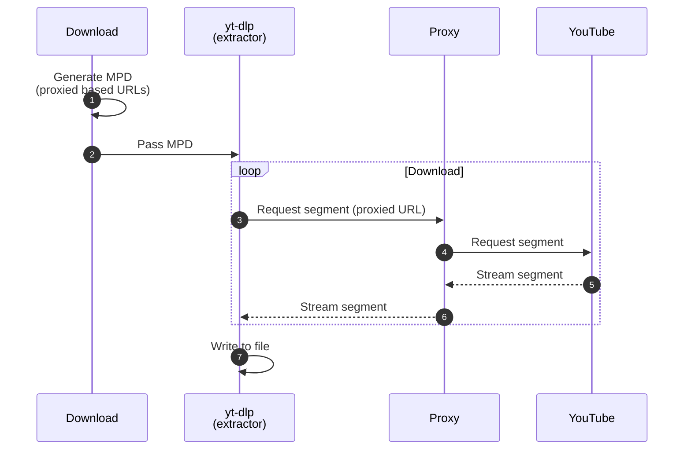

# Ypb — A playback for YouTube live streams

[](https://github.com/xymaxim/ypb/actions/workflows/test.yml)
[](https://github.com/xymaxim/ypb/releases/latest)

[Project page](https://github.com/xymaxim/ypb) &nbsp; [Documentation](https://xymaxim.github.io/ypb) &nbsp; [Changelog](https://xymaxim.github.io/ypb/changelog/)

*Rewind to past moments in live streams and play or download excerpts*

Ypb is a playback tool for YouTube live streams written in Go. It provides
MPEG-DASH access to past moments in live streams, allowing you to rewind beyond
the web player's limits, play selected excerpts instantly in any compatible
player, or download them as local files.

## Features

- Standalone CLI and proxy streaming server for playback
- Rewind precisely to past moments far beyond the web player’s limits
- Play excerpts without downloading via a built-in web player
- Capture a single frame or a timelapse of frames
- Works with any MPEG-DASH compatible player or downloader
- Uses [yt-dlp](https://github.com/yt-dlp/yt-dlp/) to reliably fetch info and download media

## Overview


```mermaid
sequenceDiagram
    autonumber
    participant D as Download
    participant E as yt-dlp<br/>(extractor)
    participant P as Proxy
    participant Y as YouTube
    D->>D: Generate MPD<br/>(proxied based URLs)
    D->>E: Pass MPD
    loop Download
        E->>P: Request segment (proxied URL)
        P->>Y: Request segment
        Y-->>P: Stream segment
        P-->>E: Stream segment
    end
    E->>E: Write to file
```
*Dowloading stream excerpts with yt-dlp's general extractor*

Ypb is built around MPEG-DASH to access past moments in YouTube live streams. A
playback proxy wraps format base URLs so media can be streamed with error retry
handling, and is used to generate manifests for the exact excerpts
requested. Behind the scenes, [yt-dlp](https://github.com/yt-dlp/yt-dlp/)
handles video metadata fetching and JavaScript challenges.

The generated manifests can be fed to a built-in dash.js player for rewinding
and watching in the browser (the `play` command), or passed to any other
MPEG-DASH compatible player or downloader. Ypb also composes static manifests to
saving excerpts to local files using yt-dlp's general extractor (the `download`
command).

See [Overview](https://xymaxim.github.io/ypb/overview/) for details.

## Installation

Ypb works on Linux, macOS, and Windows.

Read the [Installation](https://xymaxim.github.io/ypb/guides/install/install/)
guide for different ways to install and run `ypb`.

## Showcase

### Download stream excerpts

Download the latest 30 seconds from a live stream:

```shell
$ ypb download --interval 30s/now Mm_zVDDUeNA && ls
Live-and-Just-Hatched-Royal_Mm_zVDDUeNA_20260102T102030+00_30s.mp4
``` 

Or download a 30-second excerpt starting at a particular time:

```shell
$ ypb download --interval '2026-01-02T10:00+00/30s' Mm_zVDDUeNA && ls
Live-and-Just-Hatched-Royal_Mm_zVDDUeNA_20260102T100000+00_30s.mp4
``` 

### Play in the browser

Start the web player:

```shell
ypb play Mm_zVDDUeNA
```

Open `http://localhost:9000` to play the live content, or edit the path
parameter to rewind to a particular time:

```text
http://localhost:9000/2026-01-02T12:00
```

### Serve stream excerpts

Start the playback server to enable rewind requests:

```shell
ypb serve Mm_zVDDUeNA
```

With the server running on the default port 9000, you can preview excerpts with
your favorite player, or with `ffplay`:

```shell
ffplay -autoexit -protocol_whitelist file,http,https,tcp,tls \
  http://localhost:9000/mpd/10m--now
```

Or download them with `yt-dlp` directly:

```shell
yt-dlp http://localhost:9000/mpd/10m--now
```

## Images & artifacts

- [ghcr.io/xymaxim/ypb](https://github.com/xymaxim/ypb/pkgs/container/ypb): main container image with yt-dlp and ffmpeg installed
- [ghcr.io/xymaxim/ypb-compose](https://github.com/xymaxim/ypb/pkgs/container/ypb-compose): compose file with ypb image plus PO token provider sidecar
- [ghcr.io/xymaxim/ypb-mock](https://github.com/xymaxim/ypb/pkgs/container/ypb-mock): generates fixture media for mock playback, without hitting YouTube. See [`containers/ypb-mock`](containers/ypb-mock) for usage.

## License

GNU General Public License v3.0.
