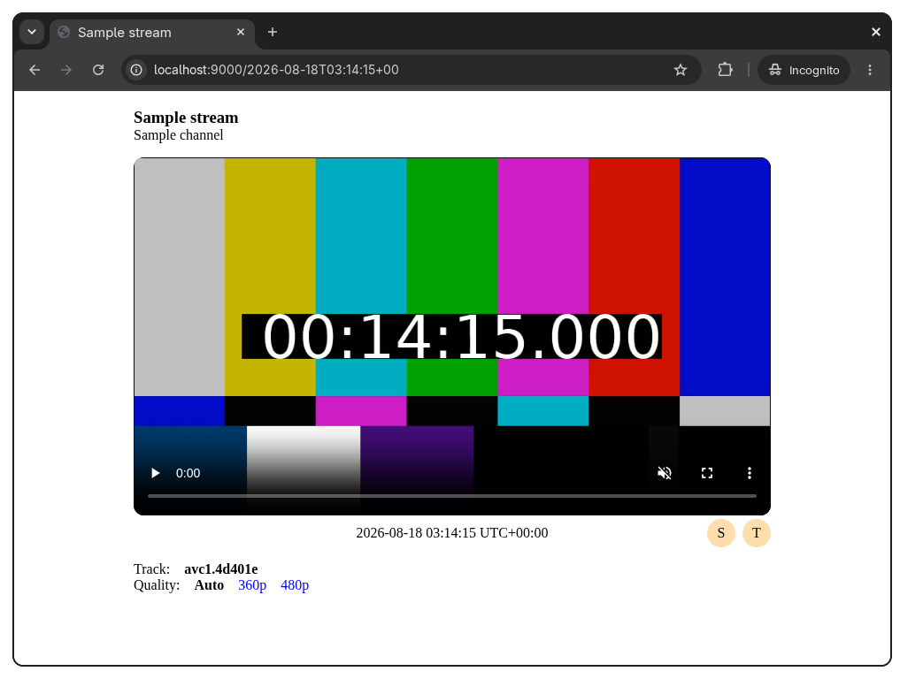

# Play a stream in the browser

Ypb includes a built-in [dash.js](https://dashjs.org/) web player for watching
live streams and rewinding to past moments without downloading anything.

   <figure>
   
   <figcaption aria-hidden="true">The built-in web player</figcaption>
   </figure>

## Prerequisites

- `ypb` installed locally, or running in a container

## Run the player

1. Run the web player for a live stream:

   ```shell
   ypb play Mm_zVDDUeNA
   ```

2. Open `http://localhost:9000` in your browser. This plays the live edge of
   the stream.

## Rewind to a past moment

To jump to a specific time instead of the live edge, add it to the path:

```text
http://localhost:9000/2026-01-02T12:00
```

> See [Specifying the rewind
> interval](../reference/cli.md#specifying-the-rewind-interval) for the accepted
> formats.

## Set the output timezone

By default, the playhead timestamp is shown in UTC. To use a different one, add
the `tz` query parameter:

```text
http://localhost:9000/2026-01-02T12:00?tz=+02
```

## Correct for streaming latency

YouTube live streams usually lag behind real time due to latency mode, network
conditions, etc. The `latency` (or `l`) query parameter corrects for this by
locating requested moments later by the given number of seconds:

```text
http://localhost:9000/12:00?latency=10
```

> See [Correcting for streaming latency](../reference/cli/#correcting-for-streaming-latency) for details.

## Use the player buttons

Below the video, two buttons are available:

| Button | Action                                      |
|--------|---------------------------------------------|
| `S`    | Take a screenshot of the current frame      |
| `T`    | Copy the current timestamp to the clipboard |
