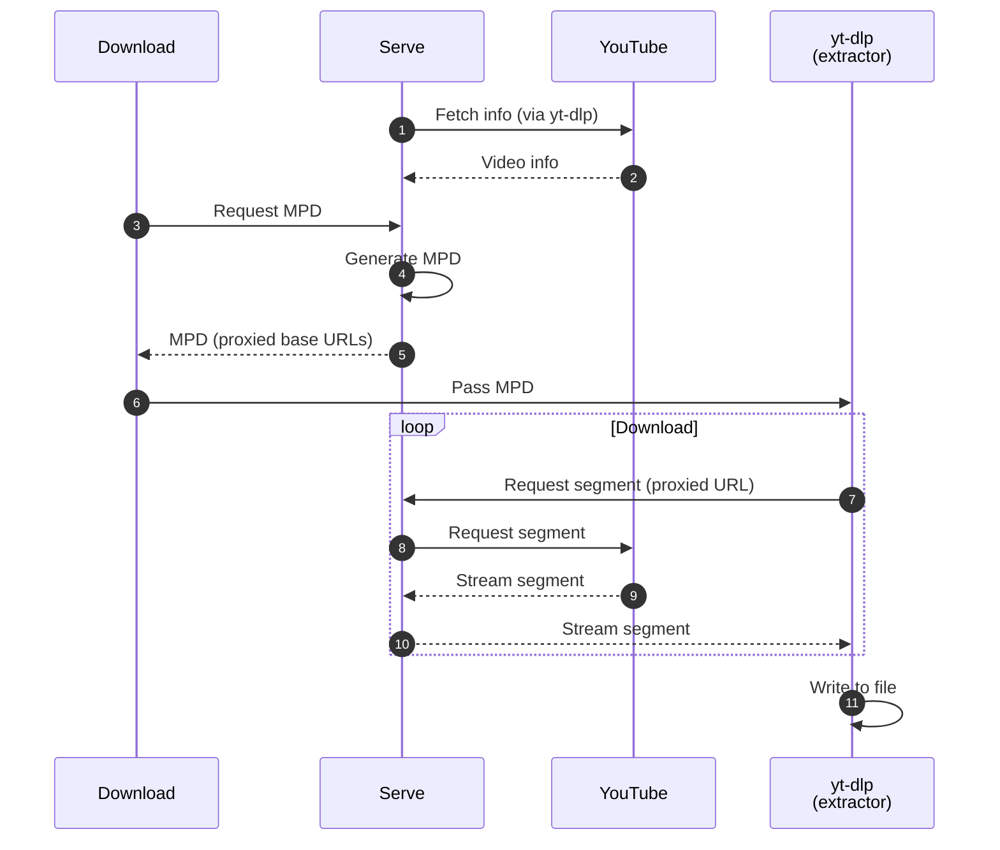

# Overview

Ypb runs in two modes: serve and download.

Serve mode runs a local HTTP proxy server that handles [API
requests](https://xymaxim.github.io/ypb/reference/api.html) to locate moments in
the stream, generate MPEG-DASH manifests (MPDs), and serve media segments with
HTTP error retry handling. It relies on yt-dlp for fetching video information
and solving JavaScript challenges.

Download mode saves excerpts to local files with
a single command, using the same proxy internally to compose manifests before
passing them to yt-dlp's general extractor.

