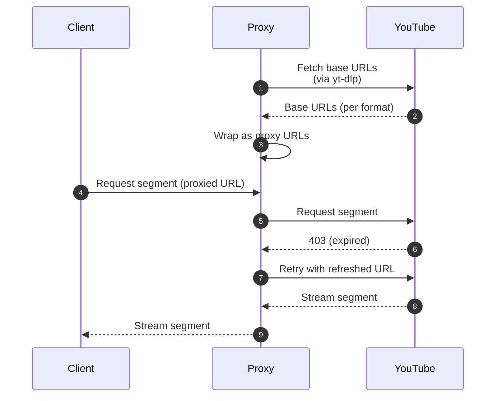
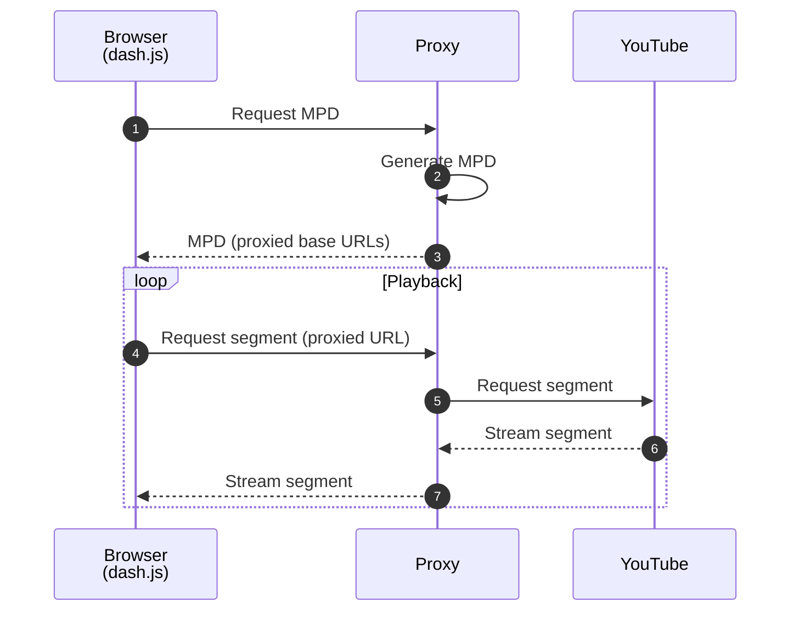
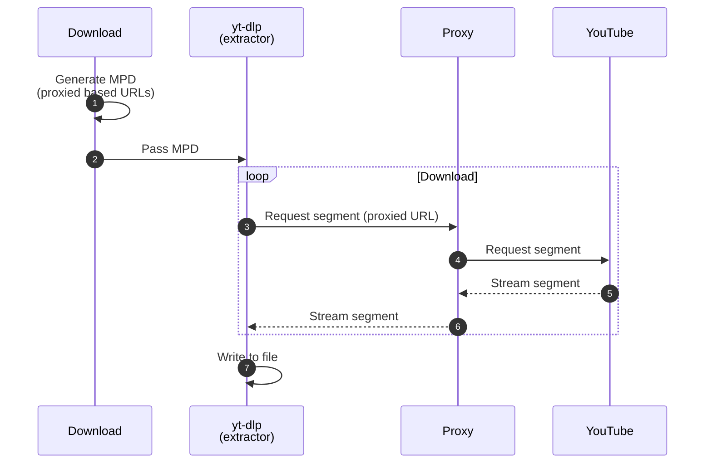

# Overview

## Core concept

Ypb is built around MPEG-DASH to rewind past moments in YouTube live streams. At
its core is a playback proxy: it wraps base URLs for each available format,
fetched with [yt-dlp](https://github.com/yt-dlp/yt-dlp), so media segment
requests aren't sent to YouTube directly and can be automatically retried on
errors such as 403s. This proxy can be served by a playback server that handles
[API](./reference/api.md) requests (the [serve](./reference/cli.md#serve)
command), including generating static and dynamic MPEG-DASH manifests (MPDs) and
streaming segments. The generated manifests can be passed to any MPEG-DASH
compatible player or downloader.

*Wrapping base URLs and retrying failed segment requests*

## Locating target segments

Rewinding to an target moment requires finding the media segment that contains
it. Ypb locates it with a three-step search:

1. **Jump-based search** --- uses time differences to quickly find a segment or
   narrow the search domain
2. **Binary search** --- refines the search within the discovered domain
3. **Gap detection** --- checks whether the target time falls within a gap

This multi-step approach handles timeline instabilities and gaps that could
otherwise cause incorrect rewind timing

## Rewatching past moments in a browser

Feeding a generated MPEG-DASH manifest (MPD) to the built-in
[dash.js](https://dashjs.org/) player, via the
[play](http://localhost:8000/ypb/reference/cli/#play) command, allows rewinding
and rewatching past moments in the browser without downloading.

*Watching past moments in the browser with a built-in player*

## Downloading excerpts to local files

Saving stream excerpts to local files is possible with a single command,
[download](http://localhost:8000/ypb/reference/cli/#download). It composes a
static MPEG-DASH manifest (MPD), then starts the proxy to stream segments before
passing it to yt-dlp's general extractor.

*Dowloading stream excerpts via yt-dlp's general extractor*
