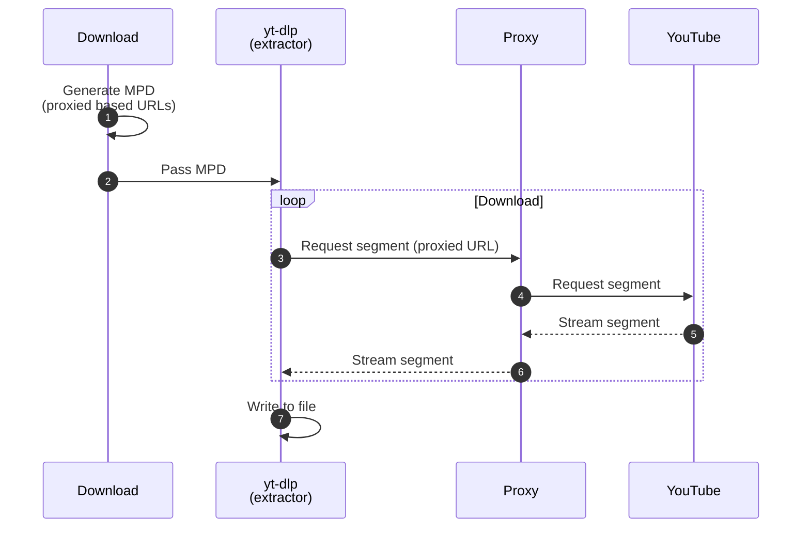
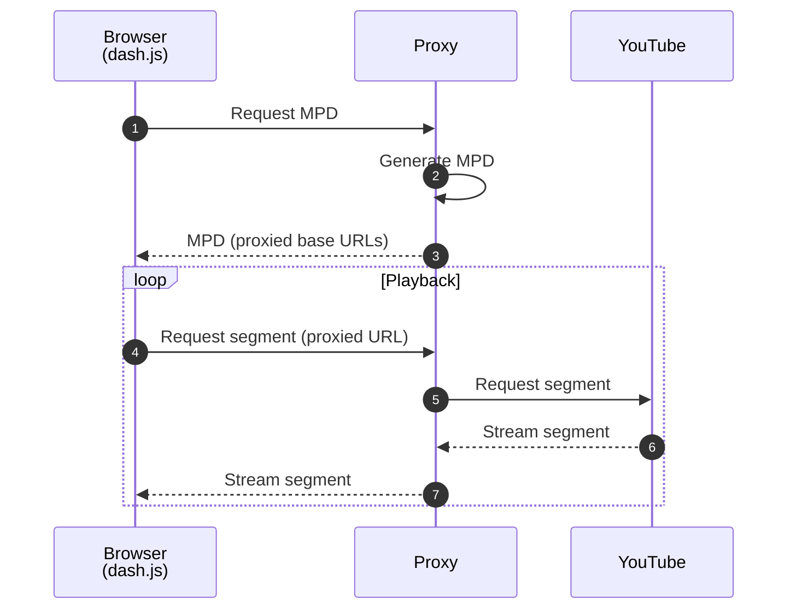

# Overview

Ypb runs in three modes: serve, download, and play.

All modes relies on [yt-dlp](https://github.com/yt-dlp/yt-dlp/) for fetching
video information and solving JavaScript challenges.

## Serve

Serve mode runs a local HTTP proxy server that handles [API](./reference/api.md)
requests to locate moments in the stream, generate MPEG-DASH manifests (MPDs),
and serve media segments with HTTP error retry handling. The generated manifests
can be passed to any MPEG-DASH compatible player or downloader.

## Download

Download mode saves excerpts to local files with a single command. It composes a
manifest, then starts the proxy to stream segments before passing it to yt-dlp's
general extractor.

## Play

Play mode is similar to serve mode, additionally serving a minimal web page with the [dash.js](https://dashjs.org/) player. The player talks to the proxy to fetch manifests and stream segments, letting you rewatch past moments in the browser.

