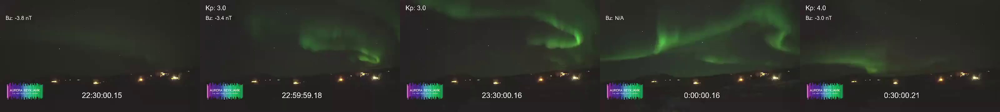
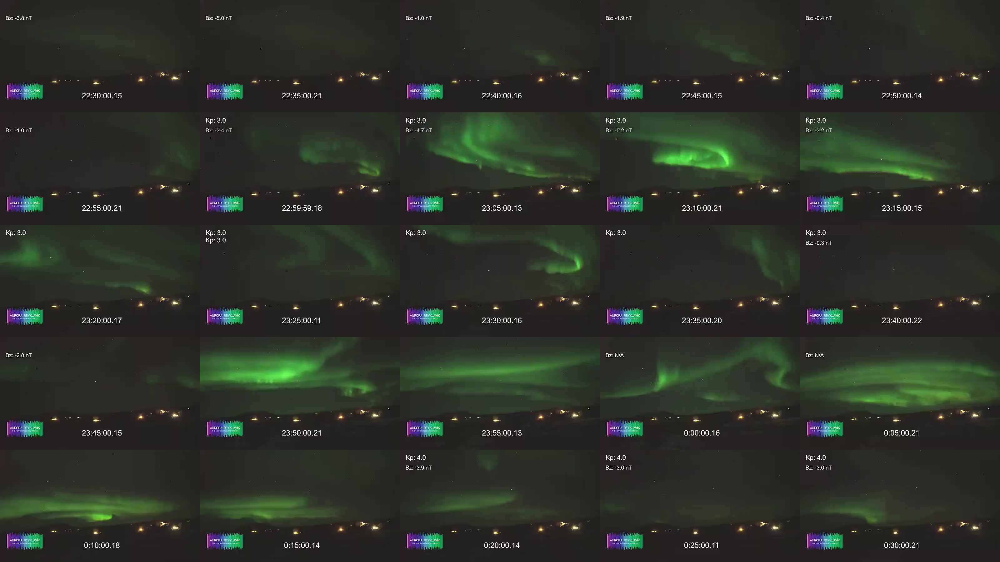

# Create a time-lapse video

In this tutorial, you will capture frames from a YouTube live stream and
assemble them into a short time-lapse video. We’ll work through the full process
from a single frame to a finished video using a [live
stream](https://www.youtube.com/live/0ujj4HexRpk/) from [Aurora Reykjavik – The
Northern Lights Center](https://aurorareykjavik.is/) as an example. Throughout,
we’ll use the [ypb capture](../reference/cli.md#capture) subcommands, which
extract frames with per-second precision (unlike [ypb
download](../reference/cli.md#download), which operates at the segment level).

## Prerequisites

Before you begin, make sure you have:

1. `ypb` [installed](../guides/install/install.md) (from pre-built binaries or a container)
2. `ffmpeg` installed (required by `ypb`)

## Step 1. Capture the first frame

Let’s start with a single frame to confirm everything is working correctly using
the [capture frame](../reference/cli.md#frame) subcommand:

``` shell
$ ypb capture frame --moment '20:00:00+00 - 1d' 0ujj4HexRpk
(<<) Collecting info about https://www.youtube.com/live/0ujj4HexRpk...
Stream 'Live Aurora stream from The Golden Circle in Iceland' is alive!
(<<) Locating and capturing the moment...
Frame to be captured: Sun, 15 Feb 2026 20:00:00 +0000, sq=38945
Success! Saved to 'Live-Aurora-stream-from-The_0ujj4HexRpk_20260215T200000+00.png'
```

<figure>

<figcaption aria-hidden="true">Captured frame:
<code>--moment '20:00:00+00 - 1d'</code></figcaption>
</figure>

> [!NOTE]
> All commands in this tutorial were supposed to run on February
> 16, 2026. The flag `20:00:00+00 - 1d` subtracts one day from the given time,
> so it means yesterday at 20:00 UTC.

Notice that the in-video timestamp is about 3 seconds earlier than the
moment we requested. This is a live stream delay. To get a frame where
the on-screen clock reads exactly 20:00:00, we need to shift the
requested moment forward by that amount:

    ypb capture frame --moment '20:00:03+00 - 1d' 0ujj4HexRpk

<figure>

<figcaption aria-hidden="true">Captured frame (shifted):
<code>--moment '20:00:03+00 - 1d'</code></figcaption>
</figure>

Now the timestamp matches our request. We’ll apply this 3-second offset
to all subsequent commands.

## Step 2. Capture all night

Nautical twilight in Reykjavík ran from 19:49 to 07:35 on February 15.  Let’s
capture it using the [capture timeline](../reference/cli.md#timelapse)
subcommand with 30-minute intervals to get a quick overview of potential aurora
activity. The `-e/--every` flag sets the interval between frames:

```shell
$ ypb capture timelapse -i '19:30:03+00 - 1d/07:30:03+00' -e 30m 0ujj4HexRpk
(<<) Collecting info about https://www.youtube.com/live/0ujj4HexRpk...
Stream 'Live Aurora stream from The Golden Circle in Iceland' is alive!

(<<) Locating start and end moments... done.
Will capture 25 frames at 30m intervals:
   Frame 0: Sun, 15 Feb 2026 19:30:03 +0000
   Frame 1: Sun, 15 Feb 2026 20:00:03 +0000
                          ...
  Frame 22: Mon, 16 Feb 2026 07:30:03 +0000
  
(<<) Capturing frames to 'Live-Aurora-stream-from-The_0ujj4HexRpk_20260215T193003+00_e30m'...
   0% |                                                | (0/23, 0 it/hr) [0s:0s]
```

<figure>

<figcaption aria-hidden="true">All frames: 2026-02-15 19:30:00
UTC–2026-02-16 07:30:00 UTC, every 30 min</figcaption>
</figure>

> [!TIP]
> The contact sheet above was created with ImageMagick:
>
>     montage *.png -tile 5x5 -mode concatenate grid.jpg

It was a clear, moonless night with active aurora. The bright flashes
are cleary visible, but it would be more interesting to get more detailed
frames. One of the brightest activities appears to be around 22:30 to
00:30:

<figure>

<figcaption aria-hidden="true">Selected moment: 2026-02-15 22:30:00
UTC–2026-02-16 00:30:00 UTC, every 30 min</figcaption>
</figure>

Let’s capture this fragment at finer intervals of 5 minutes to see the
aurora’s movement in more detail:

```shell
ypb capture timelapse -i '22:30:03+00 - 1d/00:30:03+00' -e 5m 0ujj4HexRpk
```

<figure>

<figcaption aria-hidden="true">Selected moment (detailed): 2026-02-15
22:30:00 UTC–2026-02-16 00:30:00 UTC, every 5 min</figcaption>
</figure>

Beautiful! This is the fragment we’ll use for the final video.

## Step 3: Plan the final capture

Before capturing hundreds of frames, calculate the output video length.

We want to cover 50 minutes of footage (3,000 seconds) and play the
result back at 24 FPS. With a 5-second capture interval:

1.  **Total frames**: 3,000 s / 5 s = 601 frames
2.  **Output video length**: 601 frames / 24 FPS = 25 s

25 seconds is a reasonable length for a time-lapse. If you want a longer
or shorter video, adjust the interval or the playback rate accordingly.

## Step 4. Capture the final frames

Now run the full capture over the 50-minute fragment at 5-second
intervals:

```shell
$ ypb capture timelapse -i '22:50:03+00 - 1d/23:40:03+00' -e 5s 0ujj4HexRpk
$ tree Live-Aurora-stream-from-The_0ujj4HexRpk_20260215T225003+00_e5s
Live-Aurora-stream-from-The_0ujj4HexRpk_20260215T225003+00_e5s
├── Live-Aurora-stream-from-The_0ujj4HexRpk_20260215T225003+00_e5s_0000.png
├── Live-Aurora-stream-from-The_0ujj4HexRpk_20260215T225003+00_e5s_0001.png
├── Live-Aurora-stream-from-The_0ujj4HexRpk_20260215T225003+00_e5s_0002.png
    ...
└── Live-Aurora-stream-from-The_0ujj4HexRpk_20260215T225003+00_e5s_0600.png

1 directory, 601 files
```

## Step 5. Assemble the video

With all frames captured, use `ffmpeg` to convert the frames into a
video:

```shell
$ ffmpeg -r 24 -i pattern_type glob -i "*.png" -c:v libsvtav1 -y output.mp4
Input #0, image2, from '*.png':
  Duration: 00:00:25.04, start: 0.000000, bitrate: N/A
  Stream #0:0: Video: png, rgb24(pc, gbr/unknown/unknown), 640x360, 24 fps, 24 tbr, 24 tbn
Stream mapping:
  Stream #0:0 -> #0:0 (png (native) -> av1 (libsvtav1))
Press [q] to stop, [?] for help
Svt[info]: -------------------------------------------
Svt[info]: SVT [version]:       SVT-AV1 Encoder Lib v3.1.2
Svt[info]: SVT [build]  :       GCC 15.2.1 20250924 (Red Hat 15.2.1-2)   64 bit
Svt[info]: -------------------------------------------
Svt[info]: Level of Parallelism: 4
Svt[info]: Number of PPCS 107
Svt[info]: [asm level on system : up to sse4_1]
Svt[info]: [asm level selected : up to sse4_1]
Svt[info]: -------------------------------------------
Svt[info]: SVT [config]: main profile   tier (auto)     level (auto)
Svt[info]: SVT [config]: width / height / fps numerator / fps denominator               : 640 / 360 / 24 / 1
Svt[info]: SVT [config]: bit-depth / color format                                       : 8 / YUV420
Svt[info]: SVT [config]: preset / tune / pred struct                                    : 8 / PSNR / random access
Svt[info]: SVT [config]: gop size / mini-gop size / key-frame type                      : 161 / 32 / key frame
Svt[info]: SVT [config]: BRC mode / rate factor                                         : CRF / 35
Svt[info]: SVT [config]: AQ mode / Variance Boost                                       : 2 / 0
Svt[info]: SVT [config]: sharpness / luminance-based QP bias                            : 0 / 0
Svt[info]: -------------------------------------------
Output #0, mp4, to 'output.mp4':
  Metadata:
    encoder         : Lavf61.7.100
  Stream #0:0: Video: av1 (av01 / 0x31307661), yuv420p(tv, progressive), 640x360, q=2-31, 24 fps, 12288 tbn
      Metadata:
        encoder         : Lavc61.19.101 libsvtav1
[out#0/mp4 @ 0x56502bfa4380] video:500KiB audio:0KiB subtitle:0KiB other streams:0KiB global headers:0KiB muxing overhead: 0.517067%
frame=  601 fps= 67 q=35.0 Lsize=     503KiB time=00:00:25.00 bitrate= 164.8kbits/s speed=2.77x
```

> [!NOTE]
> On Windows, glob patterns are not supported. Use the explicit numeric pattern instead:
>
>     -i Live-Aurora-..._e5s_%04d.png

The key options:

- `-r` — output frame rate (frames per second)
- `-pattern_type glob -i "*.png"` — match all PNG files in the current directory
- `-c:v libsvtav1` — encode using the SVT-AV1 codec

We used the [SVT-AV1 encoder](https://trac.ffmpeg.org/wiki/Encode/AV1)
here for its excellent balance of compression and speed, but any encoder
will work. To see what’s available on your machine:

    ffmpeg -hide_banner -encoders

Your time-lapse video is now ready at `output.mp4`.

## Useful links

1. <https://en.vedur.is/weather/forecasts/aurora/> — Aurora forecast from the Icelandic Met Office
2. <https://aurorareykjavik.is/aurora-forecast/> — Aurora forecast on Aurora Reykjavik
3. <https://www.youtube.com/@aurorareykjavik/> — Aurora Reykjavik on YouTube
